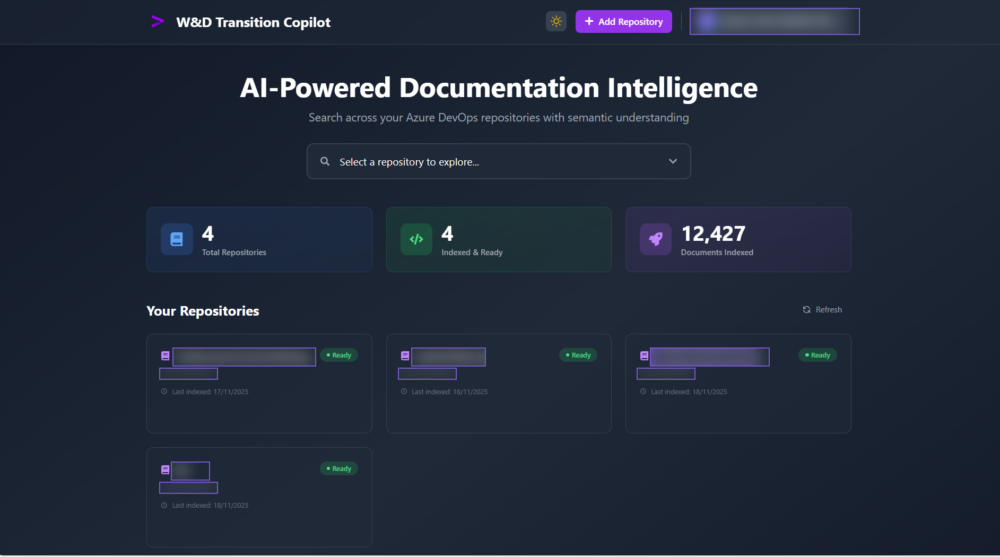

**CodeWiki Bot** is an AI-powered documentation and chat assistant that sits on
top of a codebase. Instead of hunting through repos and outdated wikis,
developers just *ask* — and get grounded answers, cross-repo dataflow
diagrams, and architecture context on demand.

## What it does

- **Graph-RAG engine** — combines a knowledge graph of the code with
  retrieval-augmented generation, so answers understand *relationships*
  between modules, not just keyword matches.
- **Cross-repo dataflow & architecture diagrams** — automatically generated
  from indexed code, spanning multiple repositories.
- **Natural-language chat over the codebase** — ask "where is X handled?" or
  "how does data flow from A to B?" and get a sourced answer.
- **Semantic search across Azure DevOps repos** — 12,000+ documents indexed
  and kept in sync.

## Why Graph-RAG (not plain RAG)

Plain RAG retrieves similar text chunks. A **graph** layer adds the *structure*
of the codebase — call relationships, data flow, module dependencies — so the
bot can reason across files and repos instead of answering from isolated
snippets. That's what makes cross-repo diagrams and "how does this connect"
questions possible.

> *Note: identifiers in the screenshot above are masked for confidentiality.*
