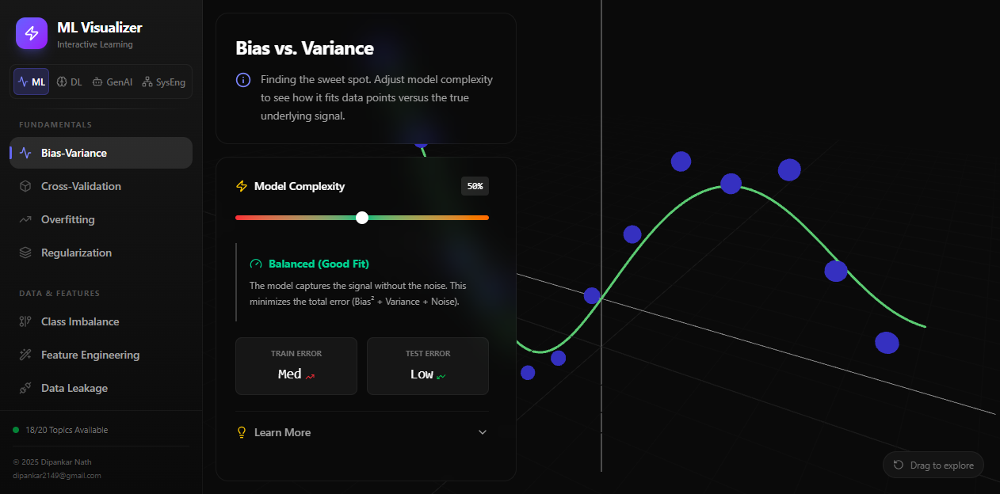

**ML Visualizer** is an interactive learning platform that turns abstract
machine-learning concepts into things you can *see and play with*. Instead of
reading a definition of bias–variance tradeoff, you drag a slider and watch the
model curve overfit or underfit in real time.

[🔗 Live demo](https://majestic-fairy-9b2adc.netlify.app/)

## The idea

Most people learn ML from static diagrams and equations. ML Visualizer flips
that: every concept is a **hands-on, interactive visualization**. Move a
control, and the chart, error metrics, and explanation all update live — so the
intuition clicks.

## What's inside

**18 of 20 topics** are live, organized into learning tracks:

- **Fundamentals** — Bias-Variance, Cross-Validation, Overfitting, Regularization
- **Data & Features** — Class Imbalance, Feature Engineering, Data Leakage, Dimensionality Reduction
- **Algorithms** — K-Means Clustering, Logistic Regression, Random Forest *(Decision Trees & SVM coming soon)*
- **Models & Training** — Gradient Descent, Activation Functions, Hyperparameters, Ensembles
- **Evaluation & Ops** — Metrics, Interpretability, Monitoring

Topics span four domains: **ML, Deep Learning, GenAI, and Systems Engineering.**

## Example: Bias vs. Variance

The flagship view lets you drag a **Model Complexity** slider from 0–100%:

- **Low complexity** → the model underfits (high bias), the curve is too simple.
- **High complexity** → it overfits (high variance), chasing noise.
- **Balanced** → it captures the true signal, and the live **Train/Test error**
  readouts show the sweet spot where total error is minimized.

Seeing the curve and the error numbers move together makes the tradeoff obvious
in a way a textbook diagram never could.

## Why I built it

Teaching intuition is hard with static content. An interactive tool lets a
learner *build a mental model by experimenting* — which is how these concepts
actually stick. It's also a fun playground for anyone brushing up before
interviews.

> Built as a self-directed project. Try the [live demo](https://majestic-fairy-9b2adc.netlify.app/)
> and drag the sliders around.
